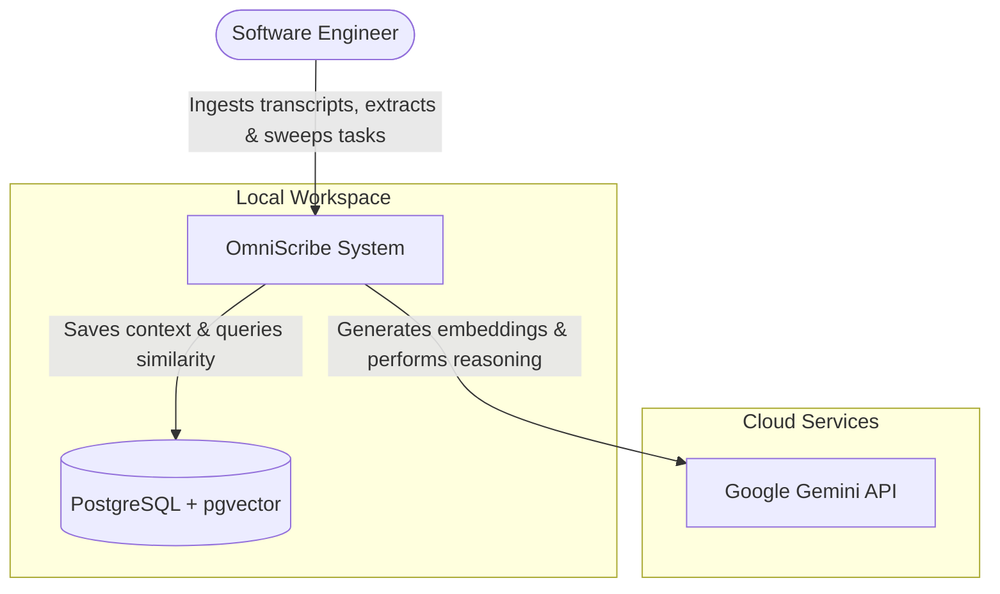
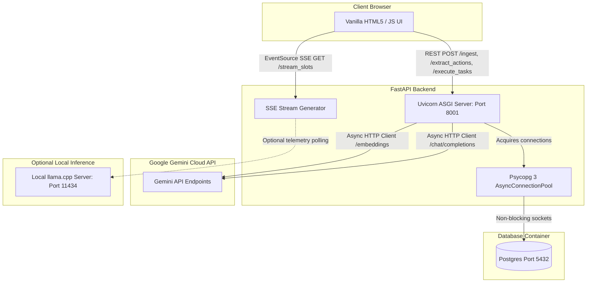
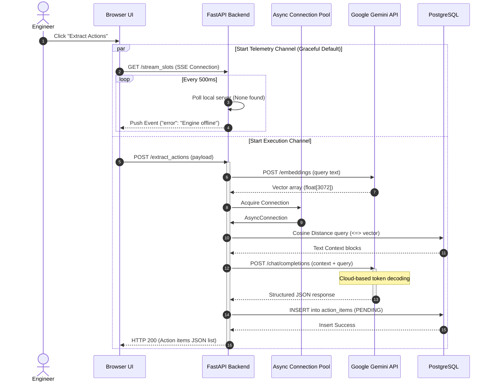
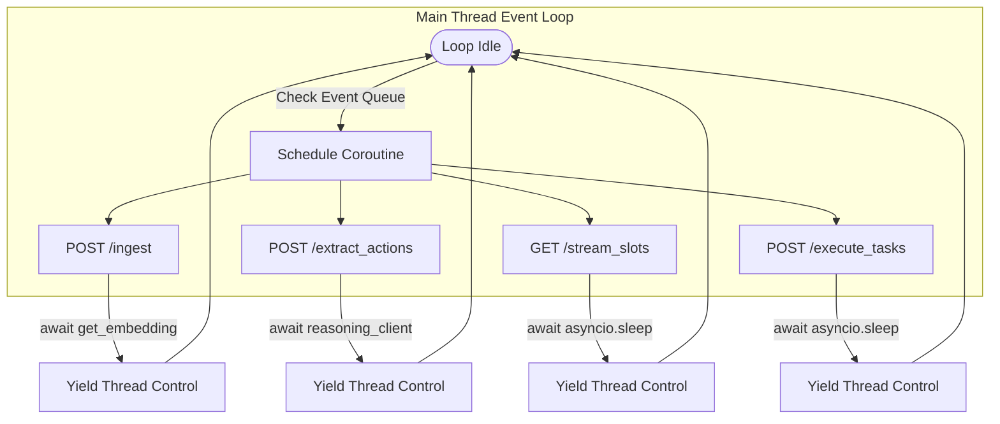
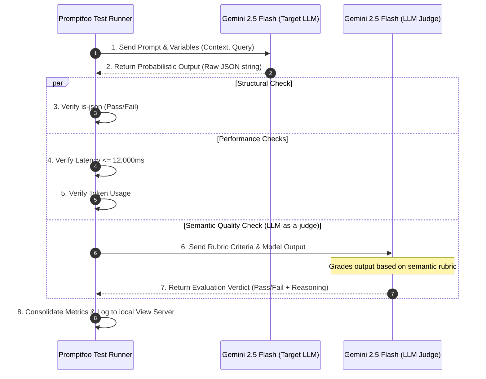

# OmniScribe: System Architecture & Technical Design

This document serves as a complete architectural reference and learning guide for the OmniScribe Process Manager. It covers the system's design patterns, database lifecycles, non-blocking sequence flows, and the core engineering decisions made to transition the codebase from a hybrid thread-pool model to a production-grade fully asynchronous architecture.

---

## 1. System Context (C4 Level 1)

This diagram shows how OmniScribe sits within the engineering workspace, interacting with the end-user and local microservices.



---

## 2. Container Architecture (C4 Level 2)

This diagram maps the internal components of OmniScribe, focusing on ports, runtimes, and protocols.



---

## 3. Core Architectural Sequences (UML)

### A. Non-Blocking Actions Extraction Flow (`/extract_actions`)
This sequence demonstrates how a user query traverses vector search, LLM completion, DB persistence, and frontend rendering, all while the parallel `/stream_slots` endpoint monitors LLM slots.



---

## 4. Key Architectural Decisions (ADR)

### Decision 1: Fully Asynchronous (`async/await`) over Synchronous Thread Pools
* **Context:** In early iterations, blocking database calls (`psycopg2`) and LLM requests were executed inside synchronous `def` endpoints. While FastAPI offloads `def` endpoints to a background thread pool, thread pools introduce overhead, do not scale to massive concurrency, and are susceptible to **thread starvation** under heavy loads.
* **Decision:** We migrated the entire system to native `async def` handlers.
* **Result:** The backend is now fully cooperative. While waiting for database sockets or LLM HTTP responses, the main thread yields control back to the ASGI event loop. This ensures that the SSE telemetry generator `/stream_slots` is guaranteed immediate CPU scheduling and remains perfectly responsive, even during intense background database write spikes.

### Decision 2: Psycopg 3 with Connection Pooling & Auto-Configuration
* **Context:** Open and close database handshakes represent significant TCP overhead (often 10–50ms of socket latency). Standard async drivers like `asyncpg` require custom wrappers to register vector adapters on every newly opened connection.
* **Decision:** We implemented Psycopg 3's `AsyncConnectionPool` and leveraged its native async configuration hook:
  ```python
  async def configure_conn(conn: psycopg.AsyncConnection):
      await register_vector_async(conn)
  ```
* **Result:** Warm database sockets are maintained and reused instantly. The `configure` parameter acts as a database connection interceptor, guaranteeing that every single database connection pulled from the pool is pre-registered to understand vector embeddings.

### Decision 3: Transition from Local hardware Slot Telemetry to Cloud APIs & Promptfoo Benchmarking
* **Context:** The application was initially designed around local inference engines (like `llama.cpp` or `Ollama`) tracking slot concurrency (`/stream_slots`). However, local LLMs introduce extreme latency, high local computing overhead, and complicate CI/CD pipelines.
* **Decision:** We migrated our core RAG model to **Google Gemini API** endpoints (using standard OpenAI-compatible structures). To handle this shift without UI breakage, the local `/stream_slots` endpoint gracefully handles connection failures by returning `{"error": "Engine offline"}`. In its place, the core observability system was shifted to **Promptfoo Test-Driven Evaluations** that track cost, precise cloud token limits, and latency directly in a dashboard.
* **Result:** Drastic improvement in query execution speeds (RAG extraction completed under 2 seconds) and standardized E2E quality validations via robust cloud endpoints.

---

## 5. The Event Loop Lifecycle & Cooperative Multitasking

To fully master this architecture, it is essential to understand Python's event loop behavior during database operations and simulated sweeps.



### The Rules of Cooperative Multitasking:
1. **Never block the event loop:** Calling synchronous blocking methods (e.g., standard `time.sleep()`, synchronous `requests.get()`, or synchronous SQL queries) freezes the loop. No other task can execute.
2. **Always await I/O operations:** By using `await`, a task explicitly signals: *"I am waiting on a socket; suspend my execution and run other tasks on this thread."*
3. **CPU-bound work remains single-threaded:** In Python, the GIL restricts bytecode execution to one thread. However, because LLM inference and PostgreSQL lookups are network/socket operations (I/O-bound), the GIL is released during awaits, achieving massive concurrent performance.

---

## 6. Test-Driven Development (TDD) for Probabilistic Outputs

In deterministic software, a unit test asserts `actual == expected`. However, large language model outputs are **probabilistic** (non-deterministic). To apply TDD to LLM outputs, we employ a multi-layered evaluation framework that measures:
1. **Quality:** Captured through semantic checks and **"LLM-as-a-judge"** assertions.
2. **Structure:** Ensuring output matches syntax requirements (e.g., JSON schema).
3. **Performance (Latency & Cost):** Validating response times and token overhead.

### LLM-as-a-Judge Architecture & Sequence (promptfoo)

The following diagram illustrates how the `promptfoo` testing suite runs evaluations against our target model (`gemini-2.5-flash`) and grades results using a secondary "judge" model:



### Key Technical Takeaways for Probabilistic TDD:
* **The LLM Grader Rubric:** Model-graded assertions (like `llm-rubric`) provide semantic checks that deterministic regexes cannot catch. For instance, asserting that the assignee and task fields match meeting turns semantically, regardless of word choices.
* **Early Observability:** Storing evaluation runs locally allows you to open `promptfoo view` (`http://localhost:15500`) to visually inspect prompt runs, trace exact token counts, and review step-by-step judge reasoning to debug why a model failed a test.

